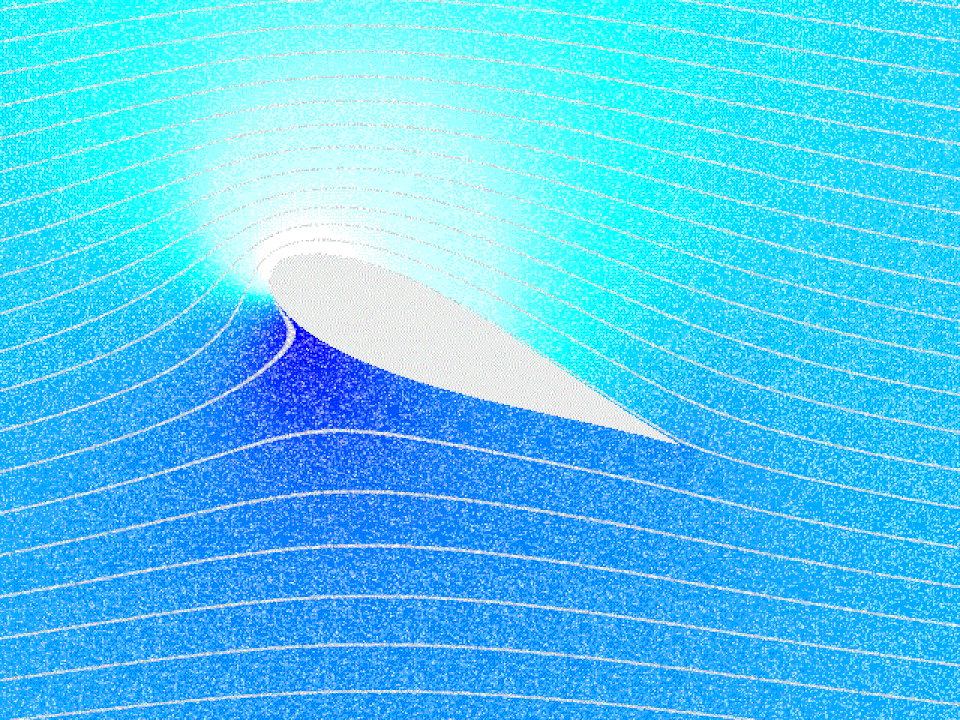
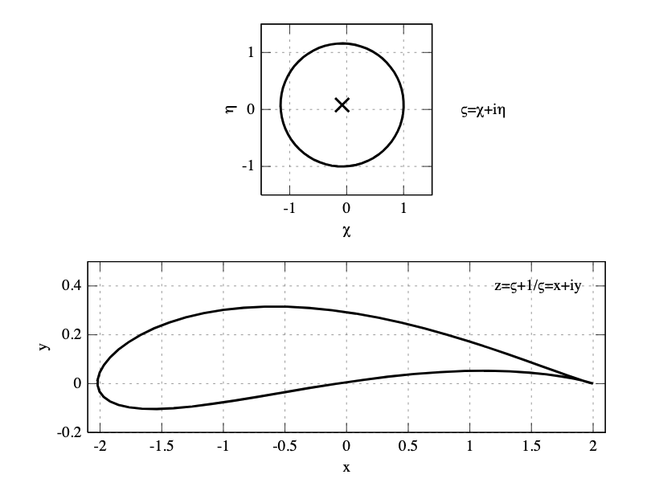
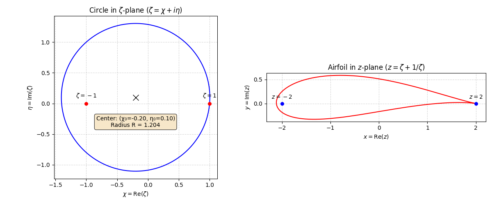
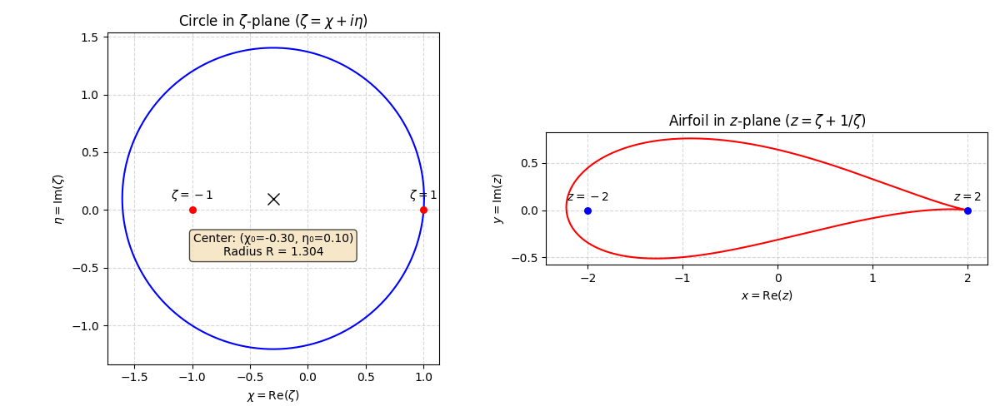
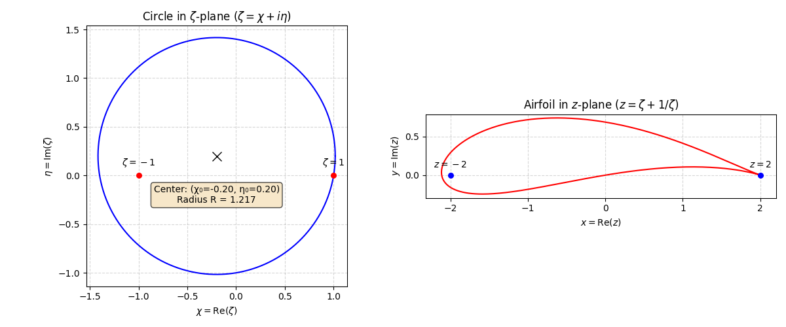
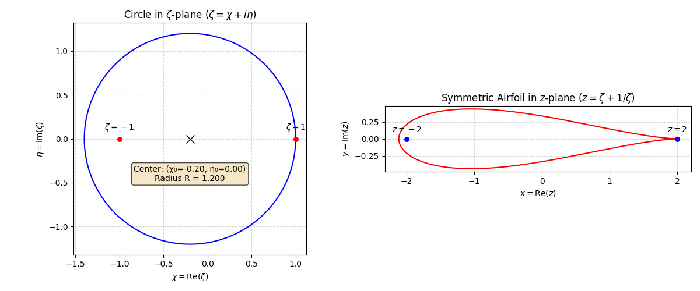
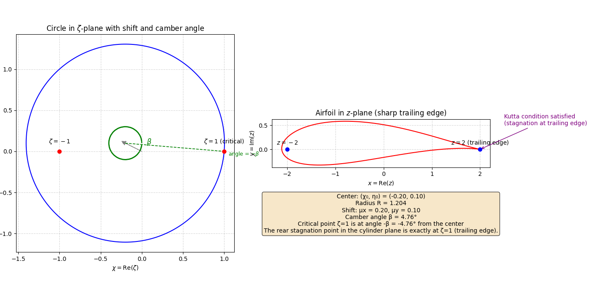
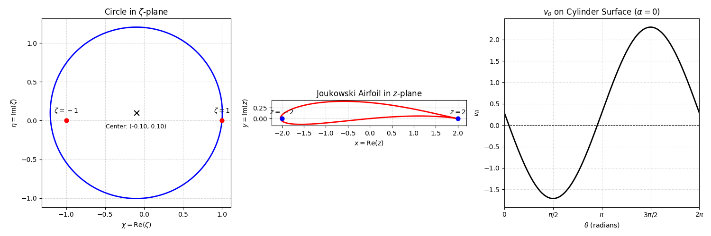
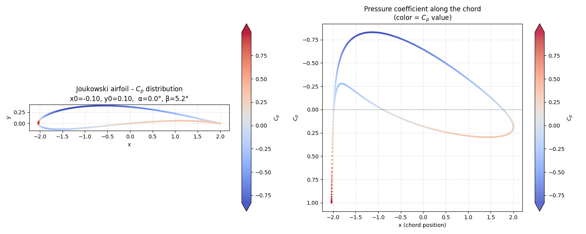

# Complex Potential, Joukowsky Transformation, and the Kutta Condition: From Cylinder Flow to Airfoil Lift

 

## 1. Complex Potential for Flow Around a Cylinder with Circulation

For steady, incompressible, inviscid, irrotational 2-D flow around a cylinder with circulation, the cleanest solution is obtained with a complex potential.

Let the cylinder have radius $R$, the uniform flow at infinity have speed $U$, and the circulation around the cylinder be $\Gamma$.

### 1.1 Complex Plane

Use:

$$
\zeta = x + iy.
$$

The cylinder is:

$$
|\zeta| = a.
$$

Take the uniform flow to be in the $+x$ direction.

### 1.2 Complex Potential

The complex potential for uniform flow plus a doublet plus circulation is:

$$
W(\zeta) = U_\infty\left(\zeta + \frac{a^2}{\zeta}\right) - \frac{i\Gamma}{2\pi} \log \zeta
$$

where:

$$
W(\zeta) = \phi(x,y) + i\psi(x,y).
$$

The three terms have straightforward interpretations:

- **$U_\infty\zeta$** is the uniform flow,
- **$U_\infty \frac{a^2}{\zeta}$** is the doublet that creates the circular cylinder boundary, and
- **$-\frac{i\Gamma}{2\pi} \log \zeta$** introduces circulation.

### 1.3 Complex Velocity

Using:

$$
\frac{dW}{d\zeta} = u - iv,
$$

we obtain:

$$
u - iv = U_\infty\left(1 - \frac{a^2}{\zeta^2}\right) - \frac{i\Gamma}{2\pi\zeta}.
$$

This is the complete velocity field in the complex plane.

### 1.4 Velocity on the Cylinder

Put:

$$
\zeta = ae^{i\theta}.
$$

Then:

$$
\frac{dW}{d\zeta} = U_\infty(1 - e^{-2i\theta}) - \frac{i\Gamma}{2\pi a} e^{-i\theta}.
$$

Converting to polar velocity components gives:

$$
v_r = 0
$$

on $r = a$, as required by the impermeability condition.

The tangential velocity is:

$$
v_\theta = -2U_\infty\sin\theta + \frac{\Gamma}{2\pi a}
$$

up to the sign convention chosen for positive circulation.

> This is an important result: circulation simply shifts the cylinder's tangential velocity distribution.

### 1.5 Pressure Distribution

Using Bernoulli's equation:

$$
p + \frac{1}{2}\rho V^2 = p_\infty + \frac{1}{2}\rho U_\infty^2,
$$

we have on the cylinder:

$$
V = v_\theta.
$$

Therefore:

$$
p(\theta) = p_\infty + \frac{1}{2}\rho \left[U_\infty^2 - \left(-2U_\infty\sin\theta + \frac{\Gamma}{2\pi a}\right)^2 \right]
$$

or, in terms of the pressure coefficient:

$$
C_p = 1 - \left(-2\sin\theta + \frac{\Gamma}{2\pi U_\infty a}\right)^2.
$$

### 1.6 Lift: The Kutta–Joukowski Result

Integrating the pressure distribution around the cylinder gives zero drag in this ideal flow:

$$
D = 0,
$$

but a nonzero lift:

$$
L' = -\rho U_\infty \Gamma
$$

where $L'$ is lift per unit span.

> The sign depends on how you define positive circulation. With the opposite convention, you will obtain $L' = \rho U_\infty \Gamma$.

This is the **Kutta–Joukowski theorem** emerging directly from the complex-potential solution.


### 1.7 A Useful Way to Visualize the Solution

The entire problem is encoded in:

$$
W(\zeta) = U_\infty\left(\zeta + \frac{a^2}{\zeta}\right) - \frac{i\Gamma}{2\pi} \log \zeta
$$

and each term has a physical role:

- **Uniform flow**: $U_\infty\zeta$
- **Cylinder (doublet)**: $U_\infty \dfrac{a^2}{\zeta}$
- **Circulation**: $-\dfrac{i\Gamma}{2\pi} \log \zeta$


The particularly elegant feature is that the cylinder boundary remains a streamline even after circulation is added, because the radial velocity remains zero at $r = R$.


### 1.8 Flow Past a Cylinder at Angle of Attack

If the uniform flow approaches the cylinder at an angle of attack $\alpha$ relative to the $+x$-axis, the uniform‑flow term needs to be rotated by $\alpha$.

Starting from

$$
W(\zeta) = U_\infty \left( \zeta + \frac{a^2}{\zeta} \right) - \frac{i\Gamma}{2\pi} \log \zeta,
$$

the modified complex potential is

$$
W(\zeta) = U_\infty \left( e^{-i\alpha} \zeta + e^{i\alpha} \frac{a^2}{\zeta} \right) - \frac{i\Gamma}{2\pi} \log \zeta,
$$

where:

- $U_\infty$ is the free‑stream velocity,
- $a$ is the cylinder radius,
- $\alpha$ is the angle between the free stream and the $+x$-axis,
- $\Gamma$ is the circulation.

#### Why do the two terms get opposite rotations?

The uniform‑flow potential is

$$
W_U = U_\infty e^{-i\alpha} \zeta.
$$

The corresponding doublet term must be

$$
W_D = U_\infty e^{i\alpha} \frac{a^2}{\zeta}
$$

to ensure that the cylinder surface $r = a$ remains a streamline.

To see this, put $\zeta = a e^{i\theta}$. Then

$$
W_U + W_D = U_\infty a \left( e^{i(\theta - \alpha)} + e^{-i(\theta - \alpha)} \right),
$$

so

$$
W_U + W_D = 2 U_\infty a \cos(\theta - \alpha),
$$

which is purely real on $r = a$. Therefore,

$$
\psi = 0
$$

on the cylinder surface, satisfying the impermeability condition.

#### Velocity field

Differentiating gives

$$
\frac{dW}{d\zeta} = U_\infty \left( e^{-i\alpha} - e^{i\alpha} \frac{a^2}{\zeta^2} \right) - \frac{i\Gamma}{2\pi \zeta},
$$

and, using

$$
\frac{dW}{d\zeta} = u - iv,
$$

this gives the velocity components.

On the cylinder surface $r = a$, the radial velocity remains

$$
v_r = 0,
$$

while the tangential velocity becomes

$$
v_\theta = -2 U_\infty \sin(\theta - \alpha) + \frac{\Gamma}{2\pi a}
$$

for the circulation sign convention we're using.

This is probably the most useful form for our derivation because it shows that introducing the attack angle simply shifts the angular dependence from $\theta$ to $\theta - \alpha$. 


### 1.9 Appendix I - How do we get: $\frac{dW}{d\zeta} = u - iv$

The key is that the complex potential is defined as

$$ W(\zeta) = \phi(x,y) + i\psi(x,y), $$

where:

- $\phi$ = velocity potential
- $\psi$ = stream function
- $\zeta = x + iy$

The result

$$ \frac{dW}{d\zeta} = u - iv $$

comes directly from the Cauchy–Riemann equations.

#### 1.9.1 Differentiate $W$

Since

$$ W = \phi + i\psi, $$

and

$$ \zeta = x + iy, $$

the complex derivative is

$$ \frac{dW}{d\zeta} = \frac{\partial W}{\partial x} $$

because $W$ is analytic.

Therefore,

$$ \frac{dW}{d\zeta} = \frac{\partial}{\partial x}(\phi + i\psi) = \phi_x + i\psi_x. $$

#### 1.9.2 Use the velocity-potential definition

For a potential flow,

$$ u = \frac{\partial \phi}{\partial x}, \quad v = \frac{\partial \phi}{\partial y}. $$

So

$$ \phi_x = u. $$

The Cauchy–Riemann equations for $W = \phi + i\psi$ are

$$ \phi_x = \psi_y, \quad \phi_y = -\psi_x. $$

Therefore,

$$ \psi_x = -\phi_y = -v. $$

Substituting these into the derivative:

$$ \frac{dW}{d\zeta} = \phi_x + i\psi_x $$

gives

$$ \frac{dW}{d\zeta} = u + i(-v). $$

Hence

$$ \frac{dW}{d\zeta} = u - iv. $$

#### 1.9.3 Why the minus sign?

The minus sign in $u - iv$ comes from the Cauchy–Riemann relation

$$ \psi_x = -\phi_y. $$

Since $v = \phi_y$, we get

$$ \psi_x = -v. $$

So the complex velocity is conventionally represented as

$$ u - iv $$

rather than $u + iv$.


### 1.10 Appendix II - Do we have the value for the circulation, $\Gamma$?

Not yet. In the solution we've been developing, $\Gamma$ is an unspecified parameter. We can solve the flow for any chosen circulation, but we cannot assign it a numerical value unless the problem gives us additional information.

For the complex potential,

$$
W(\zeta) = U_\infty\left(\zeta + \frac{a^2}{\zeta}\right) - \frac{i\Gamma}{2\pi} \log \zeta,
$$

$\Gamma$ is defined by

$$
\Gamma = \oint_C \mathbf{V} \cdot d\mathbf{s}
$$

and has units of

$$
[\Gamma] = \text{m}^2/\text{s}.
$$


#### 1.10.1 Where could $\Gamma$ come from?

There are several possibilities:

##### A. The problem specifies $\Gamma$
For example, $\Gamma = 10 \, \text{m}^2/\text{s}$. Then we simply use that value.

##### B. The cylinder is rotating
If the cylinder has angular velocity $\Omega$, its rotation can generate circulation. For an ideal rotating cylinder, a common relation is

$$
\Gamma = 2\pi a^2 \Omega,
$$

with the sign depending on the convention for positive rotation.

##### C. A boundary condition determines $\Gamma$
In some aerodynamic problems, an additional condition such as a **Kutta condition** determines the circulation. This is what happens for flow around an airfoil. For a perfectly circular cylinder, however, there is no sharp trailing edge, so the Kutta condition does not uniquely select $\Gamma$.


#### 1.10.2 For our cylinder problem

If our goal is simply to demonstrate flow around a cylinder with circulation, it is perfectly legitimate to leave

$$
\Gamma
$$

as a parameter.

Then the surface velocity is

$$
v_\theta = -2U_\infty\sin\theta + \frac{\Gamma}{2\pi a},
$$

and the lift per unit length becomes

$$
L' = -\rho U_\infty \Gamma.
$$

> This is actually quite elegant: we don't need to know the numerical value of $\Gamma$ to demonstrate the Kutta–Joukowski result.


### 1.11 Appendix III - How do we get $\Gamma = 2\pi a^2 \Omega$

#### 1.11.1 Circulation for a Rotating Cylinder

The cleanest way to understand $\Gamma = 2\pi a^2 \Omega$ is to start from the definition of circulation and the rotational speed of the cylinder.

##### A. Rotating cylinder

Suppose a cylinder has radius $a$ and rotates with angular velocity $\Omega$.

The tangential speed of its surface is

$$
V_\theta = a\Omega.
$$

This is simply the familiar relation $v = r\Omega$ evaluated at $r = a$.

##### B. Calculate the circulation

Circulation is defined as

$$
\Gamma = \oint_C \mathbf{V} \cdot d\mathbf{s}.
$$

Take $C$ to be a circle following the cylinder's surface.

Along this circle, the velocity and the path element are both tangential, so

$$
\mathbf{V} \cdot d\mathbf{s} = V_\theta ds.
$$

The circumference element is

$$
ds = a d\theta.
$$

Therefore,

$$
\Gamma = \int_0^{2\pi} V_\theta a d\theta.
$$

For the rotating cylinder,

$$
V_\theta = a\Omega,
$$

so

$$
\Gamma = \int_0^{2\pi} (a\Omega) a d\theta.
$$

Since $a$ and $\Omega$ are constants,

$$
\Gamma = a^2 \Omega \int_0^{2\pi} d\theta.
$$

Thus,

$$
\Gamma = 2\pi a^2 \Omega.
$$

##### C. Important caveat

For our inviscid, irrotational flow model, we shouldn't interpret this as saying that the entire surrounding fluid is rotating like a solid body.

Instead, we represent the effect of the cylinder's rotation by a vortex flow:

$$
v_\theta(r) = \frac{\Gamma}{2\pi a}.
$$

At the cylinder surface $r = a$,

$$
v_\theta(a) = \frac{\Gamma}{2\pi a}.
$$

If we require this surface velocity to equal the cylinder's rotational speed $R\Omega$,

$$
\frac{\Gamma}{2\pi a} = a\Omega,
$$

which again gives

$$
\Gamma = 2\pi a^2 \Omega.
$$

So there are really two equivalent ways to see where the expression comes from:

- Directly from the line integral:

$$
\Gamma = \oint V_\theta ds = (a\Omega)(2\pi a) = 2\pi a^2 \Omega.
$$

- Or using the vortex representation:

$$
\frac{\Gamma}{2\pi a} = a\Omega \implies \Gamma = 2\pi a^2 \Omega.
$$

#### 1.11.2 One important qualification

I would not present $\Gamma = 2\pi a^2 \Omega$ as a universal law for a real rotating cylinder. A real fluid has viscosity and a boundary layer, and the actual circulation generated by a spinning cylinder depends on the flow conditions.

For the idealized potential-flow model, however, this is a useful way to connect the prescribed cylinder rotation $\Omega$ with the circulation parameter $\Gamma$.

&nbsp;
&nbsp;
&nbsp;
&nbsp;

## 2. Joukowsky Transformation

This chapter explains the Joukowsky transformation and flow past a cylinder under the clockwise circulation convention.

  
By Krishnavedala - Own work, CC BY-SA 4.0, https://commons.wikimedia.org/w/index.php?curid=38181984

&nbsp;
&nbsp;

### 2.1 Complex Potential with Clockwise Circulation

When modeling uniform flow past a cylinder of radius $R$ inclined at an angle of attack $\alpha$, the complex potential $W(\zeta)$ is written as:

$$
W(\zeta) = U_\infty \left( \zeta e^{-i\alpha} + \frac{a^2}{\zeta e^{-i\alpha}} \right) - \frac{i\Gamma}{2\pi} \ln\left(\frac{\zeta}{a}\right)
$$

Notice the minus sign before the logarithmic term:

- **Minus sign ($-i\Gamma$):** Enforces clockwise circulation for $\Gamma > 0$.
- **Velocity effect:** A clockwise vortex adds velocity to the upper surface of the cylinder (where the freestream flow goes left‑to‑right) and reduces velocity on the lower surface.
- **Bernoulli's Principle:** Higher velocity on top yields lower static pressure; lower velocity on the bottom yields higher static pressure.

### 2.2 The Kutta‑Joukowsky Theorem and Upward Lift

Under the clockwise convention ($\Gamma > 0$), the Kutta‑Joukowsky theorem yields a straightforward positive lift equation without needing artificial sign adjustments:

$$
L = \rho_\infty V_\infty \Gamma
$$

Where:

- $L$ = Lift force per unit span
- $\rho_\infty$ = Fluid density
- $V_\infty$ = Freestream velocity
- $\Gamma$ = Clockwise circulation ($\Gamma > 0 \implies \text{Upward Lift}$)

### 2.3 Mapping the Cylinder to an Airfoil (Joukowsky Mapping)

The Joukowsky transformation maps the complex $\zeta$-plane (where the cylinder flow is solved) to the physical $z$-plane (where the airfoil lives) using the conformal function:

$$
z = \zeta + \frac{c^2}{\zeta}
$$

To obtain a realistic airfoil in the $z$-plane:

- **Center Shift:** The cylinder's center in the $\zeta$-plane is shifted slightly away from the origin ($\zeta = 0$).
  - Shift along the **negative real axis** → adds thickness to the airfoil.
  - Shift along the **positive imaginary axis** → adds camber (curvature) to the airfoil.
- **Trailing Edge Mapping:** The circle passes through the critical point $\zeta = c$, which maps directly to the sharp trailing edge of the airfoil in the $z$-plane.
- **Scale Parameter:** $c$.
   
#### 2.3.1 Joukowsky Mapping Code  

```python
import numpy as np
import matplotlib.pyplot as plt

def joukowski_transform(zeta):
    """
    Apply the Joukowski mapping:
        z = ζ + 1/ζ
    where ζ is a complex number in the circle plane.
    """
    return zeta + 1.0 / zeta

def generate_circle(center, radius, n_points=500):
    """
    Return complex points on a circle in the ζ-plane.
    ζ = χ + iη
    """
    theta = np.linspace(0, 2*np.pi, n_points, endpoint=True)
    chi = center.real + radius * np.cos(theta)
    eta = center.imag + radius * np.sin(theta)
    return chi + 1j * eta

# --- Parameters for a cambered airfoil ---
# Circle must pass through ζ = 1 (trailing edge at z = 2)
# and enclose ζ = -1 (to keep the profile closed).
chi0 = -0.2          # centre real part (negative → camber)
eta0 = 0.1           # centre imaginary part (non‑zero → camber)
# Radius forced by passing through ζ = 1
R = np.sqrt((1 - chi0)**2 + eta0**2)

# Generate points on the circle in the ζ-plane
zeta_points = generate_circle(complex(chi0, eta0), R)

# Map to the z-plane (airfoil) using Joukowski
z_points = joukowski_transform(zeta_points)

# ---- Plotting ----
fig, (ax1, ax2) = plt.subplots(1, 2, figsize=(12, 5))

# ============== Left: ζ-plane (circle) ==============
ax1.plot(zeta_points.real, zeta_points.imag, 'b-', linewidth=1.5)

# Mark the critical points ζ = 1 and ζ = -1
ax1.scatter([1, -1], [0, 0], color='red', s=30, zorder=5)

# Mark the center with a large 'X'
ax1.plot(chi0, eta0, 'kx', markersize=10)

# Add a text box with the exact parameters (no radial line)
info_text = f'Center: (χ₀={chi0:.2f}, η₀={eta0:.2f})\nRadius R = {R:.3f}'
ax1.text(chi0, eta0 - 0.3, info_text, ha='center', va='top',
         bbox=dict(boxstyle='round', facecolor='wheat', alpha=0.7),
         fontsize=10)

ax1.set_aspect('equal')
ax1.grid(True, linestyle='--', alpha=0.5)
ax1.set_xlabel(r'$\chi = \mathrm{Re}(\zeta)$')
ax1.set_ylabel(r'$\eta = \mathrm{Im}(\zeta)$')
ax1.set_title('Circle in $\zeta$-plane ($\zeta = \chi + i\eta$)')
ax1.text(1, 0.1, r'$\zeta=1$', ha='center')
ax1.text(-1, 0.1, r'$\zeta=-1$', ha='center')

# ============== Right: z-plane (airfoil) ==============
ax2.plot(z_points.real, z_points.imag, 'r-', linewidth=1.5)

# Mark the images of ζ = 1 and ζ = -1 in the z-plane
ax2.scatter([2, -2], [0, 0], color='blue', s=30, zorder=5)

ax2.set_aspect('equal')
ax2.grid(True, linestyle='--', alpha=0.5)
ax2.set_xlabel(r'$x = \mathrm{Re}(z)$')
ax2.set_ylabel(r'$y = \mathrm{Im}(z)$')
ax2.set_title('Airfoil in $z$-plane ($z = \zeta + 1/\zeta$)')
ax2.text(2, 0.1, r'$z=2$', ha='center')
ax2.text(-2, 0.1, r'$z=-2$', ha='center')

plt.tight_layout()
plt.show()
```   

[View the full Python script here →](Python/Joukowski_transformation.py)  

[Download the raw script](https://raw.githubusercontent.com/Einsteinish/Joukowsky-Transformation-Kutta-Condition/main/Python/Joukowski_transformation.py)  

  


#### 2.3.2 The current parameter set

- **Center of the circle**:

$$
(\chi_0, \eta_0) = (-0.2, 0.1)
$$

- **Radius**:  

$$
R = \sqrt{(1 - \chi_0)^2 + \eta_0^2}
    = \sqrt{1.2^2 + 0.1^2}
    = \sqrt{1.45}
    \approx 1.204
$$

This means the circle is shifted **left by $0.2$** and **up by $0.1$** relative to the origin, while still forced to pass through $\zeta = 1$ (the trailing‑edge point).


#### 2.3.3 What Each Parameter Does to the Airfoil in the $z$-Plane

##### A. $\chi_0 = -0.2$ (Horizontal shift left) → Controls **Thickness**

- Because the center is shifted left, the radius $R$ becomes greater than $1$ ($R \approx 1.204$).  
- The circle now encloses the point $\zeta = -1$ (which maps to $z = -2$ inside the airfoil).  
- The more negative $\chi_0$ (e.g., $-0.3$), the larger the radius and the **thicker** the airfoil becomes.  
- With $\chi_0 = -0.2$, you get a moderately thick airfoil (roughly 10-12% thickness‑to‑chord ratio).  
- If $\chi_0$ were $0$ (center at origin), the circle would be the unit circle and map to a flat plate (zero thickness).


##### B. $\eta_0 = 0.1$ (Vertical shift up) → Controls **Camber** (curvature)

- Shifting the circle upward breaks the symmetry about the real axis.  
- This asymmetry in the $\zeta$-plane translates directly into camber in the $z$-plane.  
- Positive $\eta_0$ (like $0.1$) creates **positive camber**: the mean camber line curves upward, meaning the upper surface has a larger curvature than the lower surface.  
- This positive camber generates lift even at zero geometric angle of attack (typical of real aircraft wings).  
- If $\eta_0 = 0$, the airfoil would be perfectly symmetric (no camber), and the upper/lower surfaces would be mirror images.


##### C. Combined Effect of $\chi_0$ and $\eta_0$

Together, these parameters produce a cambered, moderately thick airfoil with the following specific characteristics:

| Feature | Result |
| :------ | :----- |
| **Trailing edge** | Perfectly sharp (cusp) at $z = 2$, because the circle passes exactly through $\zeta = 1$. |
| **Leading edge** | Smooth and rounded (maps from the leftmost point of the circle). |
| **Camber line** | Curves upward (positive camber) due to $\eta_0 > 0$. |
| **Max thickness** | Occurs around 30-40% of the chord, typical for subsonic wings. |
| **Chord line** | Runs from trailing edge $z = 2$ to the leading edge (around $z \approx -0.4$ to $-0.5$ on the real axis). |


##### D. Physical / Aerodynamic Meaning

- The airfoil will produce **positive lift at zero angle of attack**.  
- The sharp trailing edge satisfies the **Kutta condition** automatically (which is why Joukowski airfoils are so useful in potential flow theory).  
- The asymmetry (camber) also means the pressure distribution is unbalanced, favouring higher velocities over the top surface.


#### 2.3.4 Try Changing the Parameters to See the Effects

- Increase $\lvert \chi_0 \rvert$ to $0.3$ → much **thicker** airfoil.  
  
  
- Increase $\eta_0$ to $0.2$ → much **more camber** (more curved).  
  

- Set $\eta_0 = 0$ while keeping $\chi_0 = -0.2$ → a symmetric, non‑lifting airfoil (still has thickness but zero camber).  
  
  

### 2.4 Fixing Circulation via the Kutta Condition

Without circulation ($\Gamma = 0$), the flow moves around the sharp trailing edge with infinite velocity, which is physically impossible in real fluids with even microscopic viscosity.

By applying the **Kutta Condition**, we set the clockwise circulation $\Gamma$ to the exact value that forces the rear stagnation point on the cylinder to map directly onto $\zeta = c$.

Mathematically, this requires:

$$
\Gamma = 4 \pi a U_\infty \sin(\alpha + \beta)
$$

(where $\beta$ is the angle associated with the camber shift of the cylinder's center)

When this specific clockwise circulation $\Gamma$ is applied:

- The flow leaves the sharp trailing edge smoothly without turning around the tip.
- The potential flow solution becomes unique.
- The calculated lift matches real‑world experimental data remarkably well for attached flows.


#### 2.4.1 Circulation for Joukowski Airfoil: Derivation of $\Gamma = 4\pi a U_\infty \sin(\alpha + \beta)$

This section explains the derivation of the circulation $\Gamma$ required to satisfy the Kutta condition for a Joukowski airfoil. The result is fundamental in potential flow theory and shows how camber and angle of attack generate lift.

##### A. Surface Velocity on the Cylinder

Consider a cylinder of radius $R$ in the $\zeta$-plane, with its center at the origin. The complex potential for uniform flow at an angle of attack $\alpha$, plus a clockwise circulation $\Gamma > 0$, yields the tangential velocity $V_\theta$ on the cylinder surface ($\zeta = R e^{i\theta}$):

$$
V_\theta(\theta) = -2 U_\infty \sin(\theta - \alpha) - \frac{\Gamma}{2\pi a}
$$

- $\theta$: angle measured counter‑clockwise from the positive real axis.
- $U_\infty$: freestream speed.
- $\Gamma$: circulation (positive clockwise).

Check Appendix 2.4.2: Derivation of the Surface Velocity $V_\theta(\theta)$.


##### B. Finding the Stagnation Points

At a stagnation point, the velocity vanishes, so $V_\theta = 0$:

$$
-2 U_\infty \sin(\theta_{\text{stag}} - \alpha) - \frac{\Gamma}{2\pi a} = 0
$$

Rearranging for $\Gamma$:

$$
\Gamma = -4 \pi a U_\infty \sin(\theta_{\text{stag}} - \alpha)
$$

Using $\sin(-x) = -\sin(x)$, we get:

$$
\Gamma = 4 \pi a U_\infty \sin(\alpha - \theta_{\text{stag}})
$$


##### C. Locating the Cylinder Center Shift $(\mu_x, \mu_y)$

To obtain a cambered and thick airfoil, the cylinder is shifted away from the origin. Let the shifted center be at:

$$
\zeta_0 = -\mu_x + i \mu_y
$$

- **Trailing‑edge condition**: The Joukowski mapping $z = \zeta + \dfrac{c^2}{\zeta}$ has a critical point at $\zeta = c$. For the mapped airfoil to have a sharp trailing edge, the cylinder’s boundary must pass through $\zeta = c$.

- **Camber angle $\beta$**: The angle from the shifted center to the critical point $\zeta = c$ defines the camber angle:

$$
\tan\beta = \frac{\mu_y}{c + \mu_x} \approx \frac{\mu_y}{a}
$$

Hence, relative to the cylinder’s center, the critical point $\zeta = c$ lies at an angle $-\beta$ (below the horizontal line through the center).


##### D. Applying the Kutta Condition

The **Kutta condition** requires that the flow leaves the sharp trailing edge smoothly, meaning that the trailing edge must be a stagnation point in the physical $z$-plane.

In the cylinder plane, this translates to the rear stagnation point $\theta_{\text{stag}}$ being exactly at the critical point:

$$
\theta_{\text{stag}} = -\beta
$$


##### E. Substituting $\theta_{\text{stag}} = -\beta$

Plug this into the circulation formula from Step 2:

$$
\Gamma = 4 \pi a U_\infty \sin\Big(\alpha - (-\beta)\Big)
$$

Thus:

$$
\Gamma = 4 \pi a U_\infty \sin(\alpha + \beta)
$$


 

##### F. Summary

- $\alpha$ = angle of attack (freestream direction relative to the chord line).
- $\beta$ = camber angle (geometric tilt of the cylinder due to vertical offset $\mu_y$; it represents the airfoil’s intrinsic curvature).
- $\alpha + \beta$ = **effective angle of attack**.

**Key insight**: Even at zero geometric angle of attack ($\alpha = 0$), a cambered airfoil ($\beta > 0$) still produces a non‑zero circulation  

$$ 
\Gamma = 4\pi a U_\infty \sin\beta  
$$ 

which generates positive lift.  


#### 2.4.2 Appendix - How to get the Surface Velocity, $V_\theta(\theta)$ (see 2.4.1.A) 

##### Derivation of Tangential Velocity on a Cylinder Surface

We can derive $v_\theta$ (the tangential velocity on the cylinder surface) directly from the complex potential for a circular cylinder of radius $R$ in a uniform flow at an angle of attack $\alpha$, with circulation $\Gamma$:

$$
W(\zeta) = U_\infty \left( \zeta e^{-i\alpha} + \frac{a^2}{\zeta e^{-i\alpha}} \right) - \frac{i\Gamma}{2\pi} \ln\left(\frac{\zeta}{a}\right)
$$

Here is the step‑by‑step derivation to extract $v_\theta$ on the cylinder boundary $\zeta = a e^{i\theta}$.

 

###### Step 1: Differentiate to get the complex velocity

The complex velocity in the $\zeta$-plane is given by:

$$
\frac{dW}{d\zeta} = u - iv
$$

Differentiate each term of $W(\zeta)$:

- Derivative of $U_\infty \zeta e^{-i\alpha}$ is $U_\infty e^{-i\alpha}$.
- Derivative of $U_\infty \dfrac{a^2 e^{i\alpha}}{\zeta}$ is $-U_\infty \dfrac{a^2 e^{i\alpha}}{\zeta^2}$.
- Derivative of $-\dfrac{i\Gamma}{2\pi} \ln(\zeta/a)$ is $-\dfrac{i\Gamma}{2\pi \zeta}$ (since $\ln(\zeta/R) = \ln\zeta - \ln a$, and the derivative of the constant $\ln a$ is zero).

So, the complex velocity is:

$$
\frac{dW}{d\zeta} = U_\infty e^{-i\alpha} - U_\infty \frac{a^2 e^{i\alpha}}{\zeta^2} - \frac{i\Gamma}{2\pi \zeta}
$$

 

###### Step 2: Evaluate on the cylinder surface

On the cylinder, $\zeta = R e^{i\theta}$. Substitute this into the derivative:

$$
\frac{dW}{d\zeta} = U_\infty e^{-i\alpha} - U_\infty \frac{a^2 e^{i\alpha}}{(a e^{i\theta})^2} - \frac{i\Gamma}{2\pi (a e^{i\theta})}
$$

Simplify the second term:

$$
\frac{a^2 e^{i\alpha}}{a^2 e^{2i\theta}} = e^{i\alpha} e^{-2i\theta} = e^{i(\alpha - 2\theta)}
$$

And the third term:

$$
\frac{i\Gamma}{2\pi a} e^{-i\theta}
$$

Thus:

$$
\frac{dW}{d\zeta} = U_\infty e^{-i\alpha} - U_\infty e^{i(\alpha - 2\theta)} - \frac{i\Gamma}{2\pi a} e^{-i\theta}
$$

 

###### Step 3: Convert to polar velocity components

In polar coordinates, the complex velocity relates to the radial and tangential components as:

$$
\frac{dW}{d\zeta} = (v_r - i v_\theta) e^{-i\theta}
$$

Therefore, to isolate $v_r$ and $v_\theta$, multiply both sides by $e^{i\theta}$:

$$
v_r - i v_\theta = e^{i\theta} \frac{dW}{d\zeta}
$$

Substitute the expression from Step 2:

$$
v_r - i v_\theta = U_\infty e^{i(\theta - \alpha)} - U_\infty e^{i(\alpha - \theta)} - \frac{i\Gamma}{2\pi a}
$$

Notice that:

$$
e^{i(\theta - \alpha)} - e^{i(\alpha - \theta)} = e^{i(\theta - \alpha)} - e^{-i(\theta - \alpha)}
$$

Using Euler's formula, $e^{ix} - e^{-ix} = 2i\sin x$, so:

$$
e^{i(\theta - \alpha)} - e^{-i(\theta - \alpha)} = 2i \sin(\theta - \alpha)
$$

Substitute this back:

$$
v_r - i v_\theta = U_\infty \left( 2i \sin(\theta - \alpha) \right) - \frac{i\Gamma}{2\pi a}
$$

Factor out the $i$:

$$
v_r - i v_\theta = i \left( 2U_\infty \sin(\theta - \alpha) - \frac{\Gamma}{2\pi a} \right)
$$

 

###### Step 4: Extract $v_r$ and $v_\theta$

Separate the real and imaginary parts:

- **Real part:** $v_r = 0$ → This confirms the impermeability condition (no flow through the cylinder surface).
- **Imaginary part:** $-v_\theta = 2U_\infty \sin(\theta - \alpha) - \dfrac{\Gamma}{2\pi a}$

Therefore, the tangential velocity on the cylinder surface is:

$$
\boxed{v_\theta = -2U_\infty \sin(\theta - \alpha) + \frac{\Gamma}{2\pi a}}
$$

 

##### Physical Interpretation of $v_\theta$

- The term $-2U_\infty \sin(\theta - \alpha)$ is the contribution from the freestream flow as it flows around the cylinder at angle of attack.
- The term $+\dfrac{\Gamma}{2\pi a}$ is a constant shift in the tangential velocity caused by the circulation.

This matches the classic result: if you set $\alpha = 0$ and $R = a$, you recover the familiar formula:

$$
v_\theta = -2U \sin\theta + \frac{\Gamma}{2\pi a}
$$

So, the derivation is clean, and this specific complex potential is perfectly designed to yield the standard surface velocity distribution!

  

[View the full Python script here →](Python/v_theta.py)  

[Download the raw script](https://raw.githubusercontent.com/Einsteinish/Joukowsky-Transformation-Kutta-Condition/main/Python/v_theta.py)  


#### 2.4.3 Appendix - The Plot Interpretation of the $v_\theta$ Plot ($\alpha = 0^\circ$)

The plot of $v_\theta$ versus $\theta$ shows how fast the fluid moves along the cylinder surface at each angle.

##### 1. The Shape of the Curve

- **Without circulation ($\Gamma = 0$):** The curve is a pure sine wave.
  - $v_\theta = 0$ at the front ($\theta = \pi$) and rear ($\theta = 0$ or $\theta = 2\pi$) → stagnation points.
  - Maximum speed occurs at the top ($\theta = \pi/2$) and bottom ($\theta = 3\pi/2$).
  - The flow is **symmetric**: top and bottom speeds are equal in magnitude.
  - **Net force = Zero** (no lift).

- **With circulation ($\Gamma > 0$):** The entire sine wave is shifted upward by a constant $+\Gamma/(2\pi a)$.

##### 2. What the Shift Does Physically

- **Breaks the symmetry**: The top and bottom speeds are no longer equal. One side becomes faster, the other slower.
- **Moves the stagnation points**: The front and rear stagnation points shift away from $\pi$ and $0$(moving downwards toward the lower surface). This tilts the flow pattern.
- **Represents the "spin" effect**: Like a rotating cylinder or a cambered airfoil, the circulation drags fluid around the surface, adding a uniform velocity boost everywhere.

##### 3. Why It Generates Lift

- Faster flow on one surface → **lower pressure** (Bernoulli's principle).
- Slower flow on the opposite surface → **higher pressure**.
- This pressure difference creates a net upward (or downward) force.
- Mathematically, this force is exactly:

$$
L = \rho_\infty U_\infty \Gamma
$$


##### 💡 Bottom Line

> The curve is literally the **mathematical footprint** of lift. The vertical shift of the sine wave represents the circulation that makes the flow asymmetric, which in turn produces the pressure imbalance that lifts the cylinder (or airfoil).  
  
  
#### 2.4.4 Pressure Coefficient $C_p$

  

[View the full Python script here →](Python/cp_alpha00_beta52.py)  

[Download the raw script](https://raw.githubusercontent.com/Einsteinish/Joukowsky-Transformation-Kutta-Condition/main/Python/cp_alpha00_beta52.py)  

##### 2.4.4.1. Reading the Flow Along the Chord

Let's walk from the leading edge to the trailing edge and see what the $C_p$ curve tells us about the flow.


###### a) Leading Edge – Stagnation Point ($x \approx -2.03$)

At the very nose of the airfoil, the flow comes to a complete stop.

- Here, $V = 0$ → $C_p = 1$.
- On our plot, look for the reddest points ($C_p \approx 1$) at the far left of the horizontal axis – they cluster around $x \approx -2.03$.


###### b) Suction Peak – Acceleration Over the Nose (just downstream, $x \approx -1.5$ to $-1.0$)

Immediately after the stagnation point, the flow must rapidly curve around the airfoil's nose. This curvature forces the flow to accelerate dramatically – especially on the upper surface, which is more convex.

- The velocity jumps above $U_\infty$ → $C_p$ becomes **negative**.
- The lowest $C_p$ (darkest blue, e.g., $-2$ to $-4$) marks the **suction peak** – the region of highest local speed and lowest pressure.
- In our scatter plot, you'll see a sharp plunge from red (stagnation) into dark blue just to the right of the leading edge. This rapid drop is the signature of a well‑designed aerodynamic shape.

 

###### c) Mid‑Chord – Sustained Pressure Difference ($x \approx -0.5$ to $1.0$)

As the flow moves further back, the upper‑surface suction remains stronger (more negative, bluer) than the lower‑surface pressure (less negative, greener/yellowish).

This asymmetry is crucial:

> Low pressure on top + higher pressure on bottom = net upward force (**lift**).

Even though $\alpha = 0^\circ$, our airfoil has camber ($y_0 = 0.1$, $\beta \approx 5.2^\circ$), so the Kutta condition forces a non‑zero circulation $\Gamma$, which creates this asymmetric distribution.

 

###### d) Pressure Recovery – Flow Slows Down ($x \approx 1.0$ to $1.9$)

As the flow approaches the trailing edge, it must slow down to meet the freestream conditions again.

- The pressure rises (i.e., $C_p$ becomes less negative), so the points move from blue back toward $C_p = 0$ (white/yellow) and occasionally slightly positive (red).
- This is called **pressure recovery** – a smooth rise in pressure that avoids flow separation.

 

###### e) Trailing Edge – Kutta Condition Satisfied ($x = 2.0$)

At the sharp trailing edge, the Kutta condition requires that the flow leaves smoothly, meaning the pressures from the upper and lower surfaces must meet exactly at the same value.

In our plot, you should see that the colours (and the vertical positions) of the upper and lower surface points become almost identical near $x = 2.0$. This confirms that:

- The circulation $\Gamma$ is correctly chosen,
- The flow exits without a discontinuity.

 

##### 2.4.4.2 🎨 What Does the Colour Tell You at a Glance?

| Colour | $C_p$ Range | Meaning |
| :--- | :--- | :--- |
| **Deep Blue** | Most negative | Strong suction – look for the suction peak |
| **Light Blue / Green** | Moderately negative | Typical of the lower surface or the rear part of the upper surface |
| **Yellow / White** | $\approx 0$ | Local speed equals freestream |
| **Red / Orange** | Positive | High pressure – stagnation regions, mostly at the leading edge |

The colour map makes it extremely easy to spot the location of the suction peak without reading the vertical axis too carefully.

---

##### 2.4.4.3 📊 How to Judge Aerodynamic Performance from This Plot

1. **Deeper suction peak** (more negative $C_p$) means higher local velocity → larger pressure difference → more lift.  
   But if the peak is too sharp, it may cause premature flow separation (stall) at higher angles.

2. If the upper and lower curves were perfectly symmetric (same colours at each $x$), there would be no net pressure difference → zero lift.  
   (This would be a symmetric airfoil at $\alpha = 0^\circ$.)

3. The **location of the suction peak** tells you about the loading distribution.  
   A peak that is very far forward (close to the nose) indicates a highly cambered or high‑lift configuration.

##### 2.4.4.3 🛩️ The Current Case

- $\alpha = 0^\circ$, $\beta \approx 5.2^\circ$ → effective angle of attack $= 5.2^\circ$.
- The suction peak is healthy,
- The pressure recovery is smooth,
- The trailing‑edge pressures match.

All signs of a **well‑behaved, lifting airfoil**.
